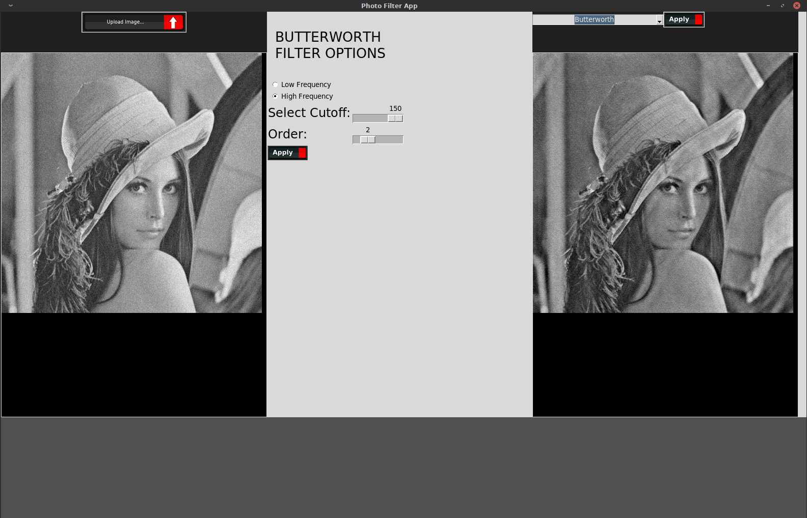
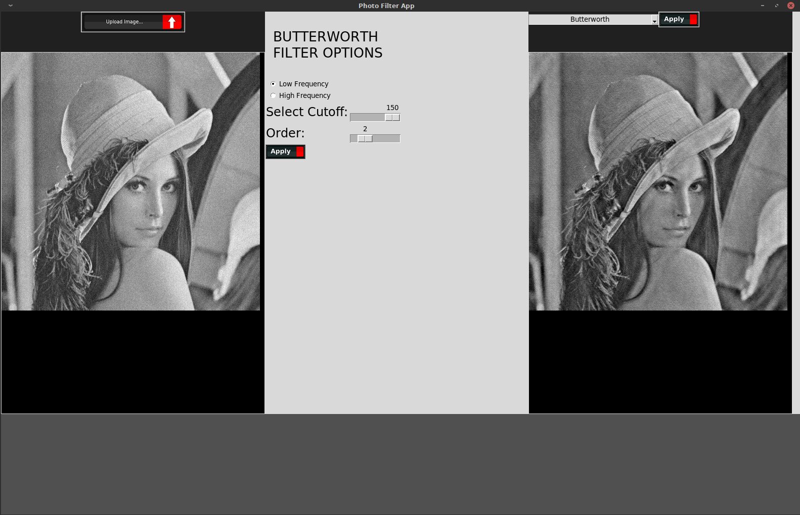
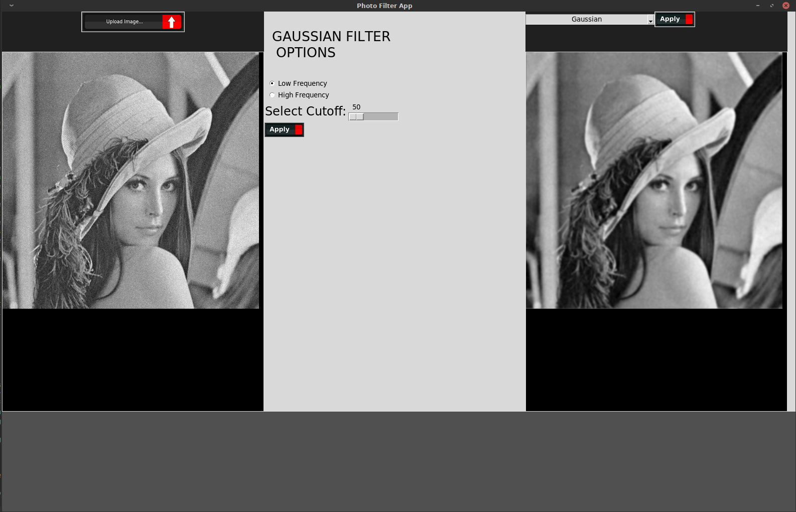
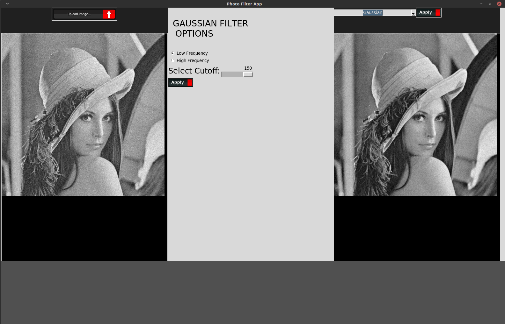
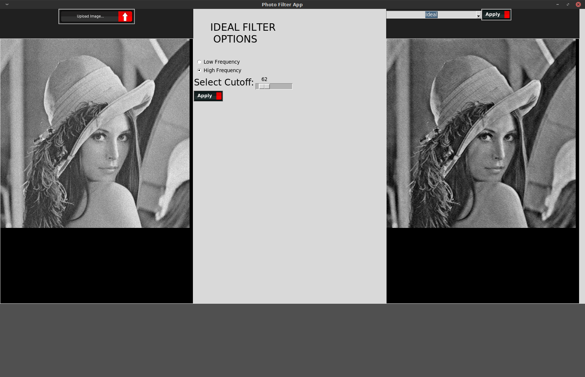
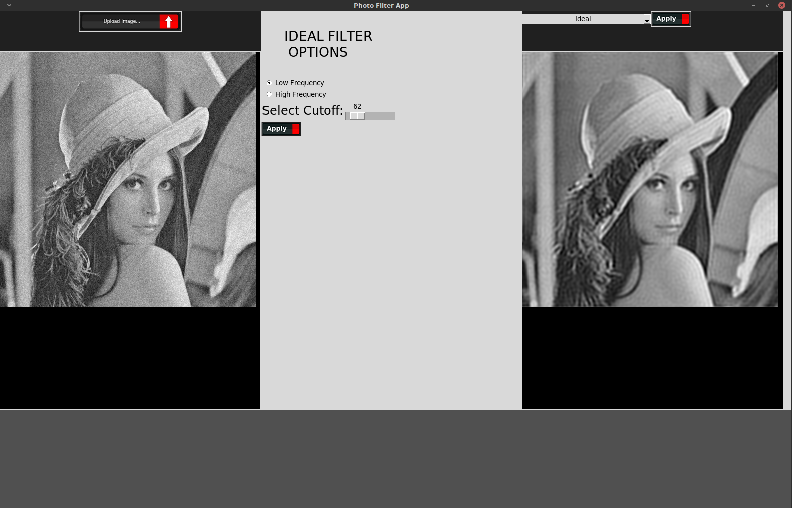

# Photo Filter App
### An image filtering application

### Purpose:
Allows user to upload an image and apply an array of filters to their image. This application utilizes the Butterworth Low/High,
 Gaussian Low/High, and Ideal Low/High frequency algorithms. More filtering algorithms will be coming soon, some to include will be
 the Olympic and Homomorphic frequencies. Another update that is in the making is peak signal-to-noise ratio (PSNR), if checked
 this will allow the computer to compute all the filters and select a suggested filter configuration for the best image quality
 of a given filter.
 
 ###  Butterworth High Frequency Cutoff: 150 Order: 2
 
 ###  Butterworth Low Frequency Cuttoff 150 Order: 2
 
 ###  Gaussian Low Frequency Cutoff: 50
 
 ###  Gaussian Low Frequency Cutoff: 150
 
 ###  Ideal High Frequency Cutoff: 62
 
 ###  Ideal Low Frequency Cutoff: 62
 
 
